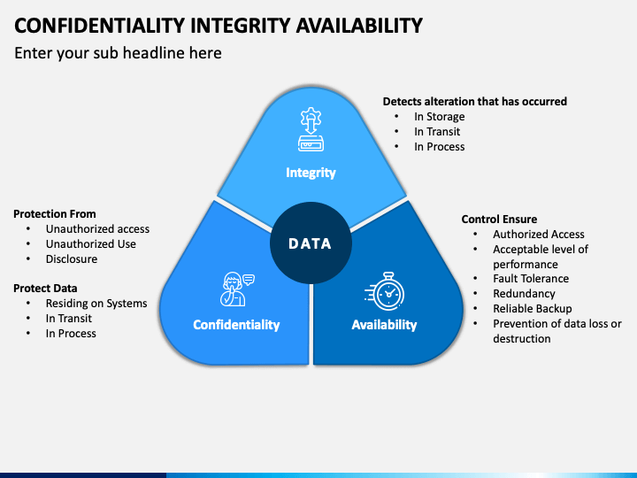

# CyberSecurity

**I have developed a range of practical scenarios for each topic. Should you need access to these resources, please do not hesitate to contact me. Furthermore, I have delivered over 100 tailored Cybersecurity Assessment Reports for a wide variety of organizations, effectively addressing their distinct risk profiles and specific requirements.**

## The Complete Architecture's Guide

  

## Introductory

### Layers of security in cybersecurity

| **Security Layer**                     | **Description**                                                                                                                            | **Key Measures**                                                  |
|----------------------------------------|--------------------------------------------------------------------------------------------------------------------------------------------|-------------------------------------------------------------------|
| **1. Physical Security**               | Protects physical components of information systems.                                                                                        | Secure access, surveillance, environmental controls               |
| **2. Network Security**                | Safeguards infrastructure and data during transmission.                                                                                   | Firewalls, IDPS, VPNs, secure networks                           |
| **3. Endpoint Security**               | Protects individual devices such as computers and mobile devices.                                                                          | Antivirus, antimalware, EDR tools, device encryption             |
| **4. Application Security**            | Secures applications from vulnerabilities throughout their lifecycle.                                                                     | Secure coding, testing, patch management, WAFs                    |
| **5. Data Security**                   | Protects sensitive data from unauthorized access and leaks.                                                                                | Data encryption, access controls, data masking, backups           |
| **6. User Awareness and Training**     | Ensures employees recognize threats and understand security policies.                                                                      | Training on phishing, social engineering, safe practices          |
| **7. Identity and Access Management**  | Manages user identities and controls access based on roles.                                                                                | MFA, SSO, strict password policies                                |
| **8. Incident Response and Management**| Establishes plans for responding to security incidents.                                                                                    | Incident response team, drills, reporting procedures              |
| **9. Security Monitoring and Logging** | Monitors systems for signs of security breaches continuously.                                                                              | SIEM systems for log aggregation and analysis                     |
| **10. Compliance and Governance**      | Ensures adherence to regulations and standards.                                                                                          | Periodic audits, assessments, and compliance checks                |

Implementing these layered security controls provides a comprehensive defense against various threats, enhancing resilience and reducing the likelihood of successful attacks.

## Information Assurance (IA)

IA is for protecting information system.

  

### Integrity

- Having AntiVirus
- Having Policies
- Data will not be tampered(altered or destroyed)

### Availability

- Who are allowed/blocked to access

### Authetication

- Identify facets

### Confidentiality

- Access by those authorized

### Non-repudiation

- someone can not deny his/her action

---

## Network Defence Approch [1]

### Preventive

- Firewalls
- Prevention Systems(IDS, IPS systems like snort)
- Intrusion Detection
- AntiVirus

### Reactive

- Responds to past and present threads
- Cover net monitoring for anomalies, forensics, and incident response
- Ad-blockers
- Spam filters
- Password manager
- AntiVirus programming

### Retrospective

- Causes for atk(after atks)
- Use protocols to:
- Analyze
- Monitored net traffic
- Prevent it from ever happening

### Proactive

- Anticipation of an atk against:
- With aims of countering future atks.

---

### Data security and threat detection

#### Terminology in Data Security

| **Term**              | **Definition**                                                                                      | **Common Use Cases**                                      |
|-----------------------|-----------------------------------------------------------------------------------------------------|----------------------------------------------------------|
| **True Positive (TP)**| A correct identification of a security threat. The system correctly detects an actual threat.      | Identifying a successful malware attack on a system.     |
| **True Negative (TN)**| A correct identification of benign activity. The system correctly identifies that there is no threat.| Confirming that a legitimate user activity is not malicious.|
| **False Positive (FP)**| An incorrect identification where a benign activity is incorrectly flagged as a threat.            | Detecting legitimate software behavior as malware, leading to unnecessary alerts. |
| **False Negative (FN)**| An incorrect identification where an actual threat goes undetected or is incorrectly classified as benign.| Failing to identify a security breach because the detection system did not recognize it. |
| **Precision**         | The ratio of true positives to the total predicted positives (TP / (TP + FP)). Higher precision means fewer false positives. | Important in environments where false alerts can disrupt operations. |
| **Recall (Sensitivity)**| The ratio of true positives to the total actual positives (TP / (TP + FN)). Higher recall means better detection of threats. | Critical for ensuring that security measures catch as many threats as possible. |
| **F1 Score**         | The harmonic mean of precision and recall, providing a balance between the two (2 *(Precision* Recall) / (Precision + Recall)). | Useful in scenarios where both false positives and false negatives are costly. |
| **ROC Curve**        | A graphical representation of the true positive rate versus the false positive rate.                | Helps evaluate the trade-offs between sensitivity and specificity in threat detection models. |

#### Use Cases for Each Term

- **True Positive (TP):**
  - Security software successfully identifies and quarantines a phishing email that contains a malicious link.
  
- **True Negative (TN):**
  - An employee's genuine access to a secure document is correctly classified as permitted, preventing unnecessary alerts to security teams.

- **False Positive (FP):**
  - An application that performs normal data transmission is flagged and quarantined as potential data exfiltration, leading to communication disruptions.

- **False Negative (FN):**
  - A new strain of malware infiltrates the network, but the detection system fails to recognize it due to outdated signatures, allowing the malware to execute.

- **Precision:**
  - In a company where every alert has a significant operational cost, high precision is crucial to minimize unnecessary investigations.

- **Recall (Sensitivity):**
  - In a healthcare environment, high recall is vital to catch all potential breaches that might expose patient information, regardless of the resulting false alarms.

- **F1 Score:**
  - In a fraud detection system where both missing fraudulent transactions and wrongly flagging legitimate transactions can lead to financial losses.

- **ROC Curve:**
  - A security analyst uses the ROC curve to determine the optimal threshold for a new intrusion detection system that balances the rates of true and false positives.

These metrics guide organizations in their threat detection efforts, helping them **fine-tune their security measures** while minimizing operational disruptions and maximizing security efficacy. Regular analysis of these metrics can inform necessary adjustments and enhancements to detection algorithms and configurations.

## Indicates the Techniques

| Phase                     | Description                                                 | Techniques (Examples)                                                                 |
|---------------------------|-------------------------------------------------------------|----------------------------------------------------------------------------------------|
| **Reconnaissance**        | Gathering information about the target to identify vulnerabilities. | - Open Source Intelligence (OSINT) - Network Scanning - Social Engineering     |
| **Resource Development**  | Establishing or acquiring resources needed for the attack. | - Malware Development - Infrastructure Setup (e.g., servers for command and control) |
| **Initial Access**        | Gaining entry into the target environment.                  | - Phishing (e.g., Email attachments, links) - Exploit Public-Facing Applications    |
| **Execution**             | Running malicious code on the target system.                | - Command-Line Interface (CLI) Execution - Malicious Scripts                       |
| **Persistence**           | Maintaining access to the target over time.                 | - Registry Run Keys/Startup Folder - Scheduled Tasks                               |
| **Privilege Escalation**  | Gaining higher privileges than initially acquired.          | - Exploiting Vulnerabilities - Bypass User Account Control (UAC)                    |
| **Defense Evasion**      | Avoiding detection and defensive measures.                    | - Obfuscated Files or Information - Timestomp                                          |
| **Credential Access**     | Obtaining valid credentials for further access.            | - Credential Dumping - Keylogging                                                    |
| **Discovery**             | Understanding the environment for further action.          | - System Information Discovery - Network Share Discovery                             |
| **Lateral Movement**      | Moving within the network after initial access.              | - Remote Services (e.g., SMB, RDP) - Pass-the-Hash                                 |
| **Collection**            | Gathering sensitive data from the target.                   | - Data Staged for Exfiltration - Screen Capture                                       |
| **Command and Control**   | Establishing a channel to control compromised systems.      | - Web Service (e.g., HTTP, HTTPS) - DNS Tunneling                                    |
| **Exfiltration**         | Extracting data from the target.                               | - Data Encoding/Obfuscation - Exfiltration Over Command and Control Channel          |
| **Impact**                | Disrupting the target’s operations or damaging systems.      | - Data Destruction - Service Stop                                                     |

## Common vulnerability

| Vulnerability   | Description                                                                            | Danger Level | Common Use-Cases                         | Prevalence (%) | Challenges Faced by Companies           | Mitigation Strategies                                   | Example Attacks                                   | Specific Attack Vectors                     |
|------------------|----------------------------------------------------------------------------------------|--------------|------------------------------------------|----------------|-----------------------------------------|-------------------------------------------------------|--------------------------------------------------|--------------------------------------------|
| **XSS**          | Enables attackers to execute scripts in the user's browser, potentially stealing cookies. | High         | User input fields, comment sections     | ~40%           | Proper input sanitization, CSP          | Sanitize user inputs, use Content Security Policy (CSP) | Stealing session cookies, redirecting users  | Stored XSS, Reflected XSS, DOM-based XSS   |
| **CSRF**         | Tricks users into making unwanted actions on web applications where they are authenticated. | Medium       | Form submissions, state-changing requests | ~30%           | Tokenization, user session management    | Implement anti-CSRF tokens, same-site cookies       | Changing user email or password without consent  | State-changing requests                     |
| **SQL Injection**| Allows attackers to execute arbitrary SQL queries on the database, leading to data exposure or manipulation. | High         | Dynamic database queries                 | ~35%           | Input validation, proper ORM usage       | Use prepared statements, parameterized queries        | Extracting sensitive data, deleting records    | Tautology-based, Union-based, Error-based   |
| **XXE**          | Occurs when an external entity is injected through XML input, leading to data exposure. | High         | XML processing, API integrations         | ~25%           | Misconfigured parsers                   | Disable DTD processing, use safer libraries          | Reading local files, SSRF (Server-Side Request Forgery) | External entity resolution             |
| **LFI**          | Allows an attacker to include files on a server through user input.                     | High         | Misconfigured web applications           | ~20%           | Input validation, file access controls  | Validate and sanitize user inputs, restrict file paths| Accessing sensitive files (e.g., /etc/passwd)  | Directory traversal                        |
| **RCE**          | Remote Code Execution allows attackers to execute arbitrary commands on the server.     | Critical     | File upload, deserialization vulnerabilities | ~15%           | Code reviews, secure coding practices    | Validate inputs, use whitelists for file types       | Executing shell commands, malware installation | Code injection, Command injection          |
| **Insecure Direct Object Reference (IDOR)** | Allows attackers to access or modify objects that they are not authorized to. | Medium     | Parameter manipulation in URL requests   | ~20%           | Authorization checks                       | Implement access controls, validate user permissions   | Accessing other users' resources                | URL manipulation                           |
| **Open Redirect** | Allows an attacker to redirect users to an untrusted site, often used for phishing.   | Medium       | Link manipulation                         | ~10%           | Input validation, whitelisting           | Validate redirect URLs, use a whitelist for valid URLs | Phishing attacks, redirecting to malicious sites | Redirecting with query parameters          |
| **HTTP Response Splitting** | Attacker manipulates HTTP headers to inject additional responses.             | Medium       | Unvalidated inputs in headers             | ~5%            | Header validation                         | Sanitize user inputs, validate and encode headers      | HTTP header injection, session fixation        | Header injection                           |
